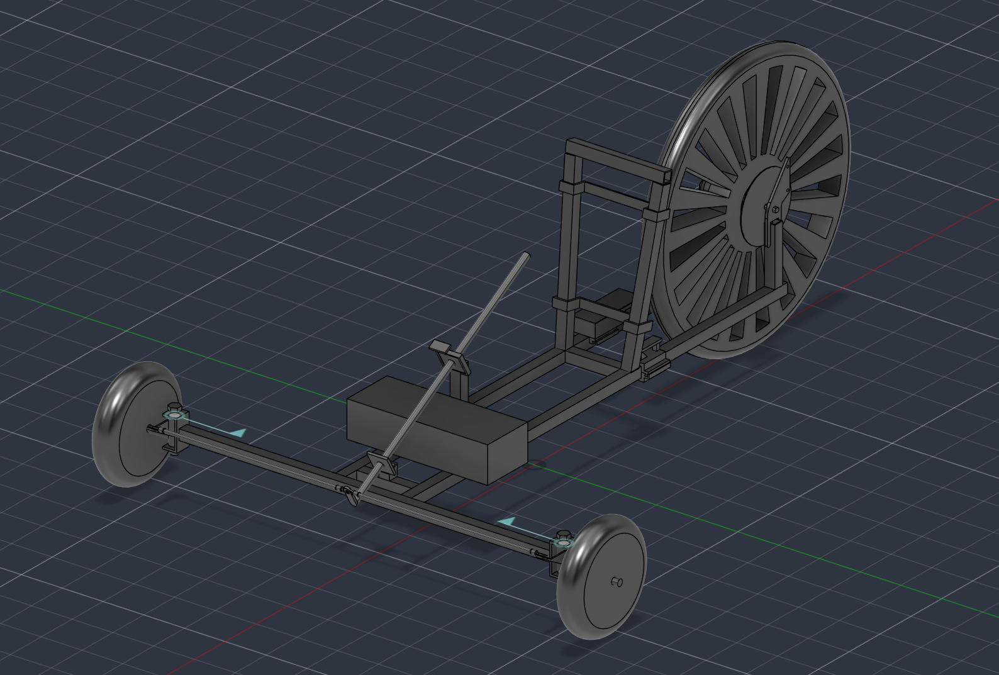
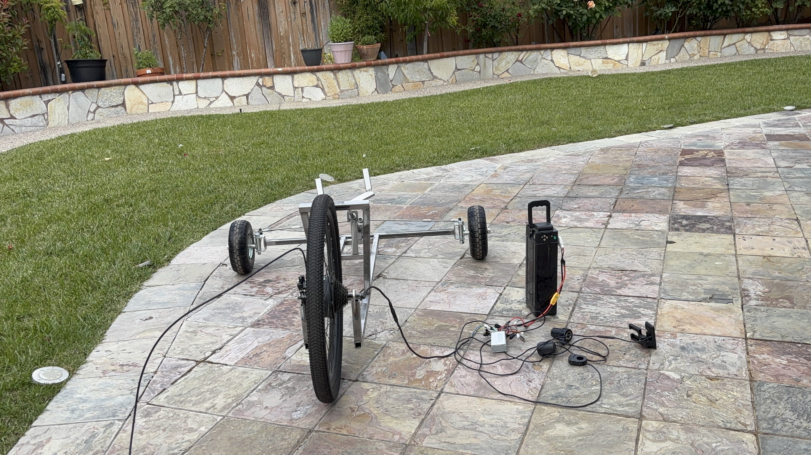

# GoKartPortfolio

A single-seat electric go-kart built from a salvaged e-bike drivetrain and a fully custom welded frame, now on its second build iteration (V2). Modeled end-to-end in CAD before fabrication, from initial concept through the load-bearing rear-wheel mount.

*Built summer 2026 · V2 rebuild logged March–May 2026 · 29 active build days across a 6-week window*

---

## CAD Model

**[→ Open the interactive CAD model (Autodesk Fusion, read-only)](https://gmail5378598.autodesk360.com/g/shares/SH28cd1QT2badd0ea72bc91f904d955a8b5e?mode=embed)**

---

## Overview

- Salvaged the motor, battery, and controller from a decommissioned e-bike
- Modeled the full assembly in CAD before any fabrication began, using the model to plan geometry and sequence the build
- Designed a custom rear-wheel mount, sized against torque loading about the axle and iterated to reduce material cost and cutting waste
- Fabricated the frame from high-carbon steel using FCAW welding; cut stock to tolerance with an angle grinder
- Rebuilt the frame in a second iteration (V2), revising chassis and T-frame dimensions based on lessons from the first build

## Frame Dimensions (V2)

| Element | Measurement | Value |
|---|---|---|
| T-frame | Vertical | 122 cm |
| T-frame | Horizontal | 91.5 cm |
| Horizontal T-frame → chassis support bar 1 | Offset | 3.5 cm |
| Last chassis support bar → frame end | Offset | 48.2 cm |
| Wheel support | Height | 14 cm |
| Chassis bar 1 → chassis bar 2 | Spacing | 20.5 cm |

## Bill of Materials

| Part | Status | Qty | Cost | Location |
|---|---|---|---|---|
| New brackets (or old ones ground down) | Installed | 2 | — | Steering |
| 50×50mm 5/8" ID plates | Installed | 4 | — | Steering |
| 12" 5/8" OD hollow rod | Installed | 2 | — | Steering |
| 29.191mm rod, 30° cut from vertical, 1"×1" | Installed | 1 | — | Steering |
| 162.136mm rod, 30° cut from vertical, 1"×1" | Installed | 1 | — | Steering |
| 186.2mm, 1"×1" | Installed | 1 | — | Seat |
| 390mm rod, 10° cut from vertical, 1"×1" | Installed | 2 | — | Seat |
| 140.6mm, 1"×1" | Installed | 2 | — | Rear large wheel support |
| Left torque flat mount + brake | Installed | 1 | $26.88 | Rear large wheel support |
| Right torque flat mount | Installed | 1 | $22.87 | Rear large wheel support |
| 135.4mm, 1"×1" | Installed | 3 | — | Chassis |
| 915mm, 1"×1" | Installed | 1 | — | Chassis |
| 1220mm, 1"×1" | Installed | 2 | — | Chassis |

## Specs

| Spec | Value |
|---|---|
| Frame material | High-carbon steel |
| Welding process | FCAW |
| Drivetrain | Salvaged e-bike motor/battery/controller |
| Design tool | Autodesk Fusion |

## References

Standards and tolerance data used during design:

- [Shimano Disc Brake Standards (2019)](https://www.peterverdone.com/wp-content/uploads/2018/06/2019-Shimano-Disc-Brake-Standards.pdf)
- [Engineering working tolerances reference](https://www.an-engineering.co.uk/working-tolerances/)

## Media

---
